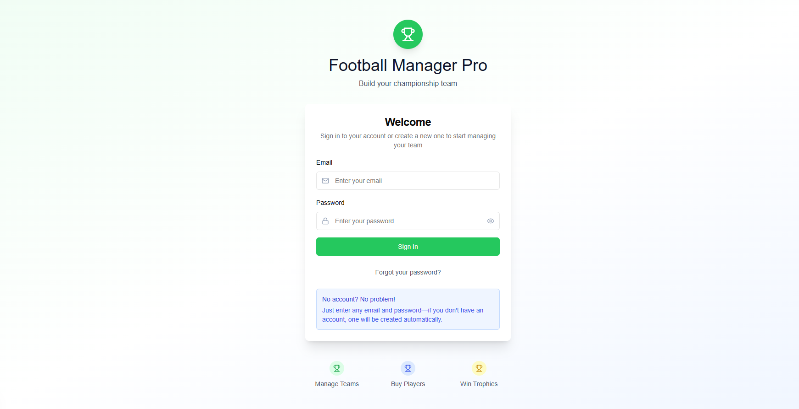

# Football Online Manager

Football Online Manager built with Next.js And Express.js.


## Quick Start

### Prerequisites

- **Node.js** (v18 or higher)
- **pnpm** (recommended) or npm
- **Docker** and **Docker Compose** (for easy setup)
- **PostgreSQL** (if running without Docker)
- **Redis** (if running without Docker)

### Option 1: Docker Setup (Recommended)

1. **Clone the repository**
   ```bash
   git clone https://github.com/azizswebni/Football-Online-Manager
   cd Football-Online-Manager
   ```

2. **Start the backend services**
   ```bash
   cd football-online-manager-backend
   docker compose up -d --build
   ```

3. **Install frontend dependencies and start**
   ```bash
   cd ../football-online-manager-frontend
   pnpm install
   pnpm dev
   ```

4. **Access the application**
   - Frontend: http://localhost:3000
   - Backend API: http://localhost:4000
   - API Documentation (Swagger UI): http://localhost:4000/api/docs
   - Queue Monitoring (Bull Dashboard): http://localhost:4000/admin/queues

### Option 2: Manual Setup

#### Backend Setup

1. **Navigate to backend directory**
   ```bash
   cd football-online-manager-backend
   ```

2. **Install dependencies**
   ```bash
   pnpm install
   ```

3. **Environment configuration**
   ```bash
   cp .env.example .env
   ```
   
   Update the `.env` file with your database credentials:
   ```env
   NODE_ENV=development
   PORT=4000
   DB_HOST=localhost
   DB_PORT=5432
   DB_USER=postgres
   DB_PASS=password
   DB_NAME=football_manager
   REDIS_HOST=localhost
   REDIS_PORT=6379
   JWT_SECRET=your-super-secret-jwt-key
   COOKIE_SECRET=your-super-secret-cookie-key
   FRONTEND_URL=http://localhost:3000
   ```

4. **Start PostgreSQL and Redis**
   ```bash
   # Using Docker for databases
   docker compose up -d --build postgres redis
   ```

5. **Run database migrations**
   ```bash
   pnpm migration:run
   ```

6. **Start the backend server**
   ```bash
   pnpm dev
   ```

#### Frontend Setup

1. **Navigate to frontend directory**
   ```bash
   cd football-online-manager-frontend
   ```

2. **Install dependencies**
   ```bash
   pnpm install
   ```

3. **Start the development server**
   ```bash
   pnpm dev
   ```

## 🛠️ Development

### Backend Commands

```bash
# Development
pnpm dev                    # Start with hot reload
pnpm dev:nodemon           # Start with nodemon

# Database
pnpm migration:generate    # Generate new migration
pnpm migration:run         # Run migrations
pnpm migration:revert      # Revert last migration

# Build
pnpm build                # Build for production
pnpm start                # Start production server
```

### Frontend Commands

```bash
# Development
pnpm dev                  # Start development server
pnpm build                # Build for production
pnpm start                # Start production server
pnpm lint                 # Run ESLint
```

## 📁 Project Structure

```
│── football-online-manager-backend/     # Express.js API
│   ├── src/
│   │   ├── config/                      # Configuration files
│   │   ├── controllers/                 # Route controllers
│   │   ├── dtos/                        # Data transfer objects
│   │   ├── interfaces/                  # TypeScript interfaces
│   │   ├── jobs/                        # Background job processors
│   │   ├── middlewares/                 # Express middlewares
│   │   ├── models/                      # TypeORM entities
│   │   ├── routes/                      # API routes
│   │   ├── services/                    # Business logic
│   │   └── utils/                       # Utility functions
│   ├── docker-compose.yaml              # Docker services
│   └── package.json
│
└── football-online-manager-frontend/    # Next.js application
    ├── app/                             # App router pages
    ├── components/                      # React components
    │   ├── atoms/                       # Basic UI components
    │   ├── molecules/                   # Composite components
    │   ├── pages/                       # Page components
    │   └── ui/                          # Radix UI components
    ├── lib/                             # Utilities and configurations
    ├── services/                        # API service functions
    ├── store/                           # Zustand state management
    └── package.json
```

## 🔧 Configuration

### Environment Variables

#### Backend (.env)
```env
NODE_ENV=development
PORT=4000
DB_HOST=localhost
DB_PORT=5432
DB_USER=postgres
DB_PASS=password
DB_NAME=football_manager
REDIS_HOST=localhost
REDIS_PORT=6379
JWT_SECRET=your-super-secret-jwt-key
COOKIE_SECRET=your-super-secret-cookie-key
COOKIE_NAME=auth_token
COOKIE_MAX_AGE=86400000
COOKIE_HTTP_ONLY=true
COOKIE_SECURE=false
COOKIE_SAME_SITE=lax
FRONTEND_URL=http://localhost:3000
```

## 📊 API Documentation

Once the backend is running, visit:
- **Swagger UI**: http://localhost:4000/api/docs
- **Health Check**: http://localhost:4000/health
- **Queue Monitoring**: http://localhost:4000/admin/queues

## 🐳 Docker

### Backend Services
```bash
cd football-online-manager-backend
docker-compose up -d     # Start all services
docker-compose down      # Stop all services
docker-compose logs      # View logs
```

### Services Included
- **PostgreSQL 15** - Main database
- **Redis 7** - Caching and job queues
- **Backend API** - Express.js application


## 📷 Project Images & Screenshots

### 1. ERD Diagram (Database)


### 2. Bull Dashboard (Queue Monitoring)


### 3. Swagger UI Documentation


### 4. App Screenshots
#### Home / Auth Page


#### Dashboard


#### Transfer Market


## 📈 Time Report

### Day 1: Understanding Requirements and Project Initialization
- **5 hours** understanding the project requirements, setting up the repository, and initializing the backend project structure.
  - Set up Node.js/TypeScript backend with Express.
  - Initialized Git repository and project documentation.
  - Configured ESLint, Prettier, and initial Docker setup.
  - Configured Docker Compose for local development (backend, Postgres, Redis).
  - Modularized codebase for scalability (controllers, services, middlewares, etc.).
  - Added error handling, logging, and validation throughout the stack.

### Day 2: Authentication Module Implementation
- **1.5 hours** Initializing the frontend project structure (Next.js, TypeScript, Tailwind CSS).
  - Implemented secure storage for sensitive data on frontend (AES-encrypted cookies).
- **2.5 hours** User registration and login (backend & frontend integration).
  - Created `/api/auth` endpoint for login/registration.
  - Built frontend login form with validation.
- **3 hours** Implemented secure JWT authentication and cookie handling.
  - Set up JWT generation, HTTP-only cookies, and secure storage on frontend.
  - Added authentication middleware and protected routes.
  - Set up Swagger UI for API documentation.
- **1 hour** Set up initial user state management and protected routes on the frontend.
  - Used Zustand for user state.
  - Implemented Next.js middleware for route protection.

### Day 3: Team & Player Modules Foundation
- **1.5 hours** Integrated Bull for background processing (team creation backend).
  - Configured Bull and Bull Board for job queues.
  - Created job for automatic team creation on user registration.
- **2 hours** Integrated Socket.IO for real-time updates (team creation frontend & backend).
  - Set up Socket.IO server and client.
  - Planned for future real-time features (Socket.IO rooms, notifications).
- **2 hours** Designed and set up TypeORM models/entities for Teams and Players.
  - Created User, Team, Player, and Transfer entities.
  - Linked models with relations.
- **2 hours** Created initial UI components for team and player management.
  - Built TeamPage and PlayerCard components.
  - Set up state management for team data.

### Days 4: Completing Team & Player Modules
- **2 hours** Designed and implemented user interface for managing team.
  - Added player listing, stats, and actions (add/remove from transfer market).
- **2 hours** Completed My Team filters by position, price, and player name.
  - Implemented search and filter logic on frontend and backend.
- **1.5 hours** Designed and implemented user interface for Transfer Market.
  - Built TransferMarketPage with player cards and buy actions.
- **1.5 hours** Implemented backend endpoints for transfer market.
  - `/api/transfer` for listing and filtering.
  - `/api/transfer/buy` for purchasing players.
- **1 hour** Added state management and React Query integration for team and transfer data.

### Day 5: Dashboard and Transfer Market Feature
- **1.5 hours** Added a functional dashboard for user insights and navigation.
  - Built DashboardPage with team stats, quick actions, and formation preview.
- **2 hours** Implemented the Transfer Market (purchase/sell players) with backend and frontend integration.
  - Connected buy/sell actions to backend.
  - Added toast notifications for feedback.
- **1 hour** Added filters and search for the market feature.
  - Enhanced UI/UX for searching and filtering players.
- **1.5 hours** Performed overall review and testing of the application.
  - Manual testing of all flows (auth, team, transfer).
  - Bug fixes and UI polish.
  - Updated documentation and screenshots.


## 💡 Future Improvements
- ✅ Add pagination and infinite scroll for player and transfer market listings
- 🔄 Integrate WebSocket for real-time transfer market updates
- 🧪 Add unit and integration tests (Jest + React Testing Library)


# Feedback

Your insights and suggestions are valuable for continuous improvement. Please feel free to share any thoughts or questions regarding the codebase, design decisions, or potential enhancements.

# Development Notes

## Architecture Decisions

**Team Ownership Model**: After reviewing the requirements, I implemented a single-team-per-user model since multiple team ownership wasn't explicitly mentioned. This simplified the data relationships and user experience.

**Background Processing**: Given the requirement for delayed team creation, I integrated Bull for background job processing with Bull Dashboard for queue monitoring. Socket.io was implemented to provide real-time updates when background jobs complete.

**Database ORM**: This project marks my first experience with TypeORM, which presented both learning opportunities and challenges in exploring this ORM's capabilities.

## Development Timeline

The development timeline provided offers a general overview of completed tasks. Actual time investment varied based on the dynamic nature of development work, with emphasis on delivering optimal outcomes rather than strict schedule adherence. Quality, maintainability, and user experience were prioritized, sometimes requiring additional research, testing, and refinement time.

## Discussion

I'm available for a call to discuss my development approach and provide detailed explanations of the implementation decisions made throughout this project.

Your feedback and suggestions for improvement are always welcome!

---

## 👨‍💻 Author

**Aziz Souabni**

---
